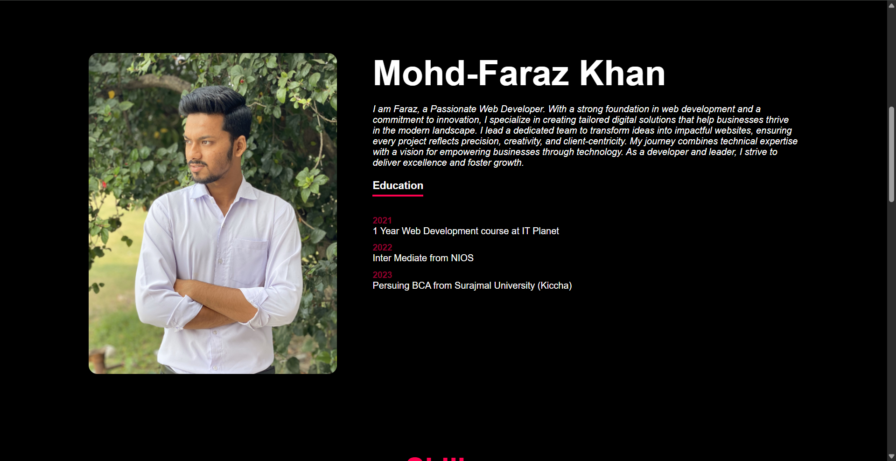
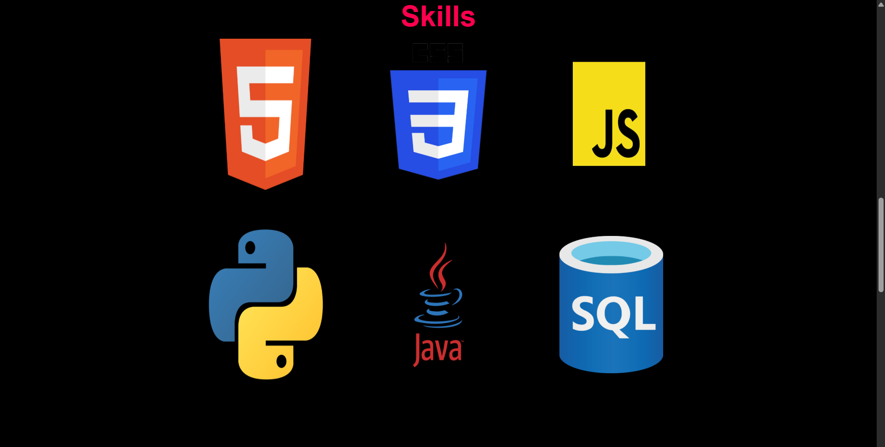

## Personal Portfolio Website

This is a responsive personal portfolio website built using HTML, CSS, and JavaScript. It showcases my background, skills, and projects as a Web/App Developer.

## Features

- Homepage with an introduction and catchy tagline.

- About Me section highlighting personal journey and education.

- Skills section showcasing core technical proficiencies.

- Projects section displaying past work with images and brief descriptions.

- Contact section with a working contact form and social media links.

- Fully responsive layout with engaging UI/UX.

## Technologies Used

- HTML

- CSS3

- JavaScript – (for interaction in future updates)

- FormSubmit – For handling contact form submissions

## Future Improvements

- Add JavaScript for form validation and animation.

- Include dynamic project filters.

- Integrate a backend to store messages or form data.

- Add dark mode toggle.

## Screenshots

